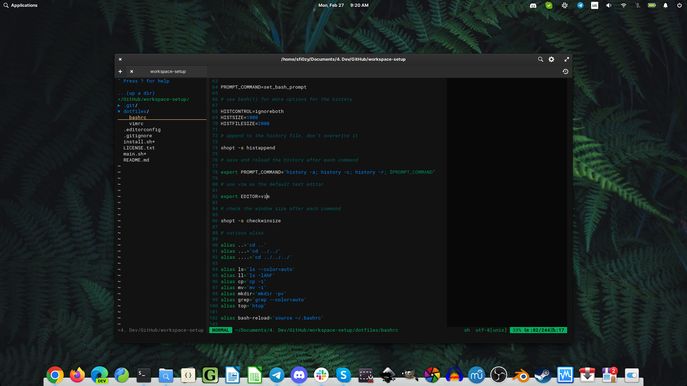

# Workspace setup for elementary OS 6



These scripts install different software, return tray icons, clean up in the launcher, configure vim as a simple frontend ide, and add visual settings for the bash and the standard terminal.

## WARNINGS

1. These scripts can install a lot of packages, texlive-full included, so you will need around 25G to install everything. It's not a problem for modern SSD, but remember about that if you want to install this configuration on some old laptop.

2. **BACKUP YOUR DATA**. These scripts were designed for usage inside the fresh system without any modifications of it. They don't have protections from your thoughtless actions.

3. You'll need some time and a stable internet connection.

## List or the software

- Web:
    - Google Chrome
    - Mozilla Firefox
    - Microsoft Edge (dev)
    - Skype
    - Slack
    - Telegram
    - Discord
- Development:
    - Git, Gitk
    - VIM (configured as a frontend IDE) + ShellCheck
    - NodeJS + NPM + n + some global packages (server one-liners)
    - Ruby
    - Docker
    - VirtualBox
- Writing tools:
    - LibreOffice
    - Gummi + full LaTeX
- Tools for creators:
    - Darktable
    - GIMP
    - Inkscape
    - SimpleScan
    - OBS
    - Blender
    - MuseScore
    - Audacity
- Games:
    - Steam
- Others:
    - Transmission
    - VLC
- System:
    - software-properties-common, curl, snapd, preload, inotify-tools
    - some additional packages, required by different software

## Install

It'll be a good idea to update everything in advance. The fresh system can have hundreds of outdated packages and this process will probably take some time. If you want to play with this setup in a virtual machine, you may also want to take a snapshot of its state after that.

```sh
sudo apt update
sudo apt upgrade
```

Then download this repository as an archive, extract it and run main script.

```sh
cd /tmp
wget https://github.com/sfi0zy/workspace-setup/archive/refs/heads/main.zip
unzip main.zip
cd workspace-setup-main
./main.sh
```

You'll be asked for a password (for sudo). Minimal gui will show some additional information and help you to select software from the list.


Installation will take some time. Then restart your computer, add SSH keys if needed, log in into your web accounts and you're ready.

## Useful links

https://elementary.io/

https://git-scm.com/book/en/v2/Getting-Started-First-Time-Git-Setup

https://docs.github.com/en/authentication/connecting-to-github-with-ssh/generating-a-new-ssh-key-and-adding-it-to-the-ssh-agent

## License

MIT License

Copyright (c) 2023 Ivan Bogachev sfi0zy@gmail.com
